# Valentine Alpaca — Project Plan v2

## Pairing Logic: Secret Link (Default) + QR Code (Bonus)

---

## How It Works — User Flow

### Flow A: Secret Link (Remote — sending to someone far away)

```
┌──────────────────────────────────────────────────────────────┐
│ PERSON A (The Initiator)                                      │
│                                                                │
│ 1. Opens valentine-alpaca.app                                  │
│ 2. Sees landing page: "Send a Valentine?"                      │
│ 3. Clicks "Create My Valentine" button                         │
│ 4. App generates unique link: valentine-alpaca.app/v/7Kx9mP    │
│ 5. Sees share options:                                         │
│    ┌─────────────────────────────────────────────┐             │
│    │  📋 Copy Link                                │             │
│    │  💬 Share via WhatsApp                       │             │
│    │  📱 Show QR Code (for in-person)             │             │
│    └─────────────────────────────────────────────┘             │
│ 6. Sends link to Person B                                      │
│ 7. Sees: GREEN alpaca + own YES/NO buttons                     │
│    + PINK alpaca grayed out with "Waiting for your Valentine…" │
│ 8. Makes their choice (YES or NO) — button locks in            │
│ 9. Waits for Person B (if they haven't chosen yet)             │
└──────────────────────────────────────────────────────────────┘

┌──────────────────────────────────────────────────────────────┐
│ PERSON B (The Recipient)                                      │
│                                                                │
│ 1. Receives link via text/WhatsApp/DM                          │
│ 2. Opens valentine-alpaca.app/v/7Kx9mP                         │
│ 3. Sees: PINK alpaca + own YES/NO buttons                      │
│    + GREEN alpaca (maybe grayed or with "They're waiting…")    │
│ 4. Makes their choice (YES or NO) — button locks in            │
│ 5. If Person A already chose → outcome reveals immediately     │
│    If not → waits with "Waiting for your Valentine…"           │
└──────────────────────────────────────────────────────────────┘

┌──────────────────────────────────────────────────────────────┐
│ OUTCOME (Both screens update simultaneously)                  │
│                                                                │
│ YES + YES → 🎉 Confetti hearts, alpacas dance together        │
│ NO  + NO  → 💔 Comedic rejection, alpacas walk away           │
│ Mismatch  → 😅 Awkward scene, one happy + one leaves          │
│                                                                │
│ "Play Again?" button resets for another round                  │
└──────────────────────────────────────────────────────────────┘
```

### Flow B: QR Code (In-Person — sitting across from someone)

```
┌──────────────────────────────────────────────────────────────┐
│ PERSON A                                                      │
│                                                                │
│ 1. Opens valentine-alpaca.app                                  │
│ 2. Clicks "Create My Valentine"                                │
│ 3. Clicks "Show QR Code" option                                │
│ 4. Phone/screen displays a QR code                             │
│ 5. Shows it to Person B sitting across the table               │
└──────────────────────────────────────────────────────────────┘

┌──────────────────────────────────────────────────────────────┐
│ PERSON B                                                      │
│                                                                │
│ 1. Scans QR with phone camera                                  │
│ 2. Opens the same valentine-alpaca.app/v/7Kx9mP link           │
│ 3. Now paired — same flow as above                             │
└──────────────────────────────────────────────────────────────┘

Same outcome logic. QR just encodes the UUID link.
```

---

## Key Design Decisions

### Identity: No Auth Needed
- Person A = whoever **created** the valentine (first to visit, row creator)
- Person B = whoever **opened the link** (second visitor, claims partner slot)
- Use browser `localStorage` to remember "I'm Person A/B on this valentine"
- A simple random `visitorId` stored in localStorage distinguishes the two
- No signup, no email, no passwords — **the link IS the invitation**

### One Valentine, One Pair
- Each UUID = one valentine between exactly 2 people
- Once Person B joins, the valentine is **locked** — no third person can play
- If someone else opens the link, they see a read-only "This Valentine is taken" message

### Choices Are Secret Until Both Choose
- Person A cannot see Person B's choice until both have submitted
- Person B cannot see Person A's choice until both have submitted
- This creates tension and excitement — **simultaneous reveal**

### Each Person Sees Their Own View
- Person A sees: GREEN alpaca (theirs) + buttons + PINK alpaca (waiting/locked)
- Person B sees: PINK alpaca (theirs) + buttons + GREEN alpaca (waiting/locked)
- After outcome: both see the full animation on their own screen

---

## High-Level Architecture

```
┌─────────────────────────────────────────────────────────────┐
│                    PHASE 1: LOVABLE                          │
│                                                               │
│  Landing Page ──→ Game Board ──→ Outcome Screen               │
│                                                               │
│  Components:                                                  │
│  ├── LandingPage        (Create Valentine + hero visual)      │
│  ├── ShareScreen        (Copy Link + QR Code + WhatsApp)      │
│  ├── GameBoard          (2 alpacas + buttons + center text)   │
│  │   ├── PixelAlpaca    (CSS grid matrix renderer)            │
│  │   ├── ChoiceButtons  (YES/NO per player)                   │
│  │   └── WaitingState   (pulse animation while waiting)       │
│  └── OutcomeOverlay     (confetti/rejection/awkward)          │
│                                                               │
│  All with LOCAL STATE (both players simulated on one screen)  │
└───────────────────────────┬─────────────────────────────────┘
                            │ Export codebase to GitHub
                            ▼
┌─────────────────────────────────────────────────────────────┐
│                PHASE 2: CURSOR + CLAUDE CODE                 │
│                                                               │
│  Add:                                                         │
│  ├── Supabase client    (lib/supabase.ts)                     │
│  ├── valentines table   (UUID, choices, status)               │
│  ├── Realtime sub       (listen for partner's choice)         │
│  ├── Route: /v/:id      (paired game view)                    │
│  ├── QR generation      (qrcode.react on share screen)        │
│  ├── localStorage       (visitor identity persistence)        │
│  └── Share API          (navigator.share for mobile)          │
└─────────────────────────────────────────────────────────────┘
```

---

## Database Schema (Phase 2 — Simple)

```sql
CREATE TABLE valentines (
  id UUID PRIMARY KEY DEFAULT gen_random_uuid(),
  created_at TIMESTAMPTZ DEFAULT now(),

  -- Identity (no auth — just random visitor IDs)
  creator_visitor_id TEXT NOT NULL,
  partner_visitor_id TEXT,

  -- Choices (null = hasn't chosen yet)
  creator_choice TEXT CHECK (creator_choice IN ('YES', 'NO')),
  partner_choice TEXT CHECK (partner_choice IN ('YES', 'NO')),

  -- Status
  status TEXT DEFAULT 'waiting' CHECK (status IN ('waiting', 'paired', 'complete'))
);

-- Enable realtime
ALTER PUBLICATION supabase_realtime ADD TABLE valentines;

-- Simple RLS
ALTER TABLE valentines ENABLE ROW LEVEL SECURITY;
CREATE POLICY "Public read" ON valentines FOR SELECT USING (true);
CREATE POLICY "Public insert" ON valentines FOR INSERT WITH CHECK (true);
CREATE POLICY "Public update" ON valentines FOR UPDATE USING (true);
```

**That's it. One table. Six columns that matter.**

---

## Page Structure

```
/                    → Landing page ("Send a Valentine?")
/create              → Creates valentine row, redirects to /v/:id
/v/:id               → The game board (both players land here)
/v/:id?shared=true   → Partner's entry point (same page, different role)
```

### Route Logic for `/v/:id`

```
1. Load valentine by ID from Supabase
2. Read visitorId from localStorage (or generate one)
3. Determine role:
   - If visitorId matches creator_visitor_id → I'm the CREATOR (green alpaca)
   - If visitorId matches partner_visitor_id → I'm the PARTNER (pink alpaca)
   - If partner_visitor_id is null → I'm joining as PARTNER
     → Update row: set partner_visitor_id = myVisitorId, status = 'paired'
   - If neither match and partner exists → "This Valentine is taken" screen
4. Subscribe to realtime changes on this row
5. Show appropriate view based on role + current state
```

---

## PHASE 1: LOVABLE (Pure Design)

### What to Build — Screen by Screen

#### Screen 1: Landing Page
- [ ] Dark purple/magenta background (#3D1F4E)
- [ ] Large playful title: "Valentine Alpaca 💌"
- [ ] Subtitle: "Ask someone to be your Valentine — pixel style"
- [ ] Mini preview: both alpacas facing each other (small, decorative)
- [ ] Big CTA button: "Create My Valentine ❤️"
- [ ] Font: "Patrick Hand" (Google Fonts)
- [ ] Subtle floating hearts animation in background

#### Screen 2: Share Screen
- [ ] "Your Valentine is ready! Share it with someone special 💌"
- [ ] Generated link displayed in a copy-able box
- [ ] Three share buttons:
  - 📋 **Copy Link** — copies to clipboard with toast confirmation
  - 💬 **Share** — uses `navigator.share()` API (WhatsApp, Messages, etc.)
  - 📱 **Show QR Code** — toggles a QR code display (for in-person)
- [ ] Below: "Waiting for your Valentine to open the link..."
- [ ] Animated dots / heartbeat pulse while waiting
- [ ] Auto-transitions to Game Board when partner joins

#### Screen 3: Game Board (The Main Event)
- [ ] Two pixel-art alpacas: GREEN (left) facing right, PINK (right) facing left
- [ ] Center text: "BE MY VALENTINE?" in large Patrick Hand font
- [ ] Below green alpaca: "ME" label + NO / YES buttons
- [ ] Below pink alpaca: "YOU" label + YES / NO buttons
- [ ] **In real multiplayer:** Each player only controls their own side
- [ ] **In Lovable mock:** Both sides are clickable for testing
- [ ] When one side chooses: their button fills with color, other side shows "waiting" pulse
- [ ] When both choose: brief dramatic pause (1s) → outcome overlay

#### Screen 4: Outcome Overlay
- [ ] Fullscreen overlay on top of the game board
- [ ] **YES + YES:**
  - Confetti hearts raining (react-confetti or Framer Motion particles)
  - Alpacas bounce toward each other with spring animation
  - Big text: "It's a Match! ❤️" with scale-up entrance
  - Warm pink glow behind the alpacas
- [ ] **NO + NO:**
  - Alpacas slowly walk off screen in opposite directions
  - Text: "Maybe Next Time... 💔" with gentle fade-in
  - Slight screen shake, then calm
  - Background dims slightly
- [ ] **Mismatch (YES + NO or NO + YES):**
  - YES-alpaca bounces hopefully
  - NO-alpaca moonwalks/slides away
  - Text: "Awkward... 😅" with a wobble animation
  - Gentle comedic tone
- [ ] "Play Again? 🔄" button at the bottom of all outcomes

---

### Pixel Art Specification

#### Alpaca Matrix (Approximate — adjust in Lovable)

Each alpaca is a grid of roughly 16 columns × 14 rows.
`1` = colored pixel, `0` = transparent.

```typescript
// Green alpaca (facing right)
export const GREEN_ALPACA: number[][] = [
  //  1  2  3  4  5  6  7  8  9 10 11 12 13 14 15 16
  [0, 0, 0, 0, 0, 0, 0, 0, 0, 0, 0, 0, 1, 1, 0, 0], // ears
  [0, 0, 0, 0, 0, 0, 0, 0, 0, 0, 0, 1, 1, 1, 1, 0], // head top
  [0, 0, 0, 0, 0, 0, 0, 0, 0, 0, 0, 1, 1, 1, 1, 0], // head
  [0, 0, 0, 0, 0, 0, 0, 0, 0, 0, 0, 1, 0, 1, 1, 0], // eye + head
  [0, 0, 0, 0, 0, 0, 0, 0, 0, 0, 0, 1, 1, 1, 0, 0], // snout
  [0, 0, 0, 0, 0, 0, 0, 0, 0, 0, 1, 1, 1, 0, 0, 0], // neck
  [0, 0, 0, 0, 0, 0, 0, 0, 0, 1, 1, 1, 0, 0, 0, 0], // neck
  [0, 0, 0, 0, 0, 0, 0, 0, 1, 1, 1, 0, 0, 0, 0, 0], // neck to body
  [0, 0, 1, 1, 1, 1, 1, 1, 1, 1, 1, 0, 0, 0, 0, 0], // body top
  [0, 0, 1, 1, 1, 1, 1, 1, 1, 1, 1, 0, 0, 0, 0, 0], // body
  [0, 0, 1, 1, 1, 1, 1, 1, 1, 1, 1, 0, 0, 0, 0, 0], // body
  [0, 0, 1, 1, 0, 0, 0, 0, 1, 1, 0, 0, 0, 0, 0, 0], // legs
  [0, 0, 1, 1, 0, 0, 0, 0, 1, 1, 0, 0, 0, 0, 0, 0], // legs
  [0, 0, 1, 1, 0, 0, 0, 0, 1, 1, 0, 0, 0, 0, 0, 0], // feet
];

// Pink alpaca = mirror of green (reverse each row)
export const PINK_ALPACA: number[][] = GREEN_ALPACA.map(row => [...row].reverse());
```

#### Rendering Component

```tsx
interface PixelAlpacaProps {
  matrix: number[][];
  color: string; // '#7CFC00' for green, '#FF69B4' for pink
  pixelSize?: number; // default 12
}

function PixelAlpaca({ matrix, color, pixelSize = 12 }: PixelAlpacaProps) {
  const columns = matrix[0].length;
  return (
    <div
      style={{
        display: 'grid',
        gridTemplateColumns: `repeat(${columns}, ${pixelSize}px)`,
        gap: '1px',
      }}
    >
      {matrix.flat().map((cell, i) => (
        <div
          key={i}
          style={{
            width: pixelSize,
            height: pixelSize,
            backgroundColor: cell === 1 ? color : 'transparent',
          }}
        />
      ))}
    </div>
  );
}
```

---

### Lovable Prompts (Sequential — One Per Iteration)

#### Prompt 1: Landing Page
```
Create a Valentine's Day web app landing page.

Background: dark purple/magenta (#3D1F4E).
Title: "Valentine Alpaca 💌" in large playful handwritten font.
Subtitle: "Ask someone to be your Valentine — pixel style"
Below: A large pink button "Create My Valentine ❤️"
Font: "Patrick Hand" from Google Fonts.
Add subtle floating heart particles in the background using Framer Motion.
Keep it centered, minimal, romantic, and mobile-friendly.
```

#### Prompt 2: Pixel Art Alpacas
```
Add a GameBoard component that shows two pixel-art alpacas side by side.

Each alpaca is rendered using a CSS grid of small colored divs.
Define each alpaca shape as a 2D array (1 = colored, 0 = transparent).
The left alpaca is GREEN (#7CFC00), the right alpaca is PINK (#FF69B4).
The pink alpaca should be a horizontally mirrored version of the green one.
They should face each other.

Between them, show large text: "BE MY VALENTINE?" in Patrick Hand font, white color.

Below the green alpaca: label "ME" and two buttons "NO" and "YES" with green borders.
Below the pink alpaca: label "YOU" and two buttons "YES" and "NO" with pink borders.
Buttons should be chunky, uppercase, with a handwritten feel.

The alpaca shapes should look like cute long-necked creatures (like a giraffe/alpaca):
- Small head with pointed ears at top
- Long diagonal neck
- Rectangular body
- Four legs (two front, two back with gap between)

Use roughly 16x14 pixel grid with 12px pixel size.
Background stays dark purple.
```

#### Prompt 3: Button Logic + Outcomes
```
Add interactive state to the GameBoard:

When a user clicks YES or NO on either side:
- The chosen button fills with its color (green fill for ME side, pink fill for YOU side)
- The other button on that side becomes disabled/dimmed
- The other alpaca's area shows a pulsing "Waiting..." text

When BOTH sides have chosen, wait 1 second then show an outcome overlay:

YES + YES:
- Confetti hearts rain down (use react-confetti or Framer Motion)
- Both alpacas bounce toward each other with a spring animation
- Show "It's a Match! ❤️" in large text with a scale-up animation
- Background gets a warm pink glow

NO + NO:
- Alpacas slide off-screen in opposite directions
- Show "Maybe Next Time... 💔" with a fade-in
- Background dims slightly

YES + NO (or NO + YES):
- The YES alpaca bounces hopefully
- The NO alpaca slides away
- Show "Awkward... 😅" with a wobble animation

Add a "Play Again 🔄" button below all outcomes that resets everything.

Use Framer Motion for all animations.
```

#### Prompt 4: Share Screen
```
Add a ShareScreen component that appears after clicking "Create My Valentine" on the landing page.

It should show:
- Title: "Your Valentine is ready! 💌"
- Subtitle: "Share this link with someone special"
- A styled box showing a URL like "valentine-alpaca.app/v/abc123" (use a mock ID for now)
- Three action buttons in a row:
  📋 "Copy Link" — copies the URL to clipboard, shows "Copied!" toast
  💬 "Share" — triggers navigator.share() if available, fallback to copy
  📱 "Show QR" — toggles showing a QR code (just show a placeholder square for now)
- Below: "Waiting for your Valentine to open the link..."
- Animated pulsing hearts or dots while waiting
- A "Continue to Game" button (for testing — skips to GameBoard)

Keep the dark purple theme and Patrick Hand font.
Make it feel exciting, like sending a secret love note.
```

#### Prompt 5: Polish & Mobile
```
Polish the entire app for mobile and desktop:

- Ensure alpacas scale down on small screens (reduce pixel size or use CSS transform scale)
- Buttons should be tap-friendly on mobile (min 44px touch targets)
- Share screen buttons should stack vertically on mobile
- Outcome overlay should be fullscreen on mobile
- Add smooth page transitions between Landing → Share → Game → Outcome
- Add a subtle heartbeat animation to the "BE MY VALENTINE?" text
- Ensure all text is readable on both screen sizes
- Test that confetti/animations don't cause performance issues on mobile
```

---

## PHASE 2: CURSOR + CLAUDE CODE (Backend Wiring)

### Step-by-Step (After Lovable Export)

#### Step 1: Setup
```bash
# Clone the Lovable export
git clone <your-repo> valentine-alpaca
cd valentine-alpaca
npm install

# Add Supabase
npm install @supabase/supabase-js

# Add QR code library (for the bonus feature)
npm install qrcode.react

# Verify it runs
npm run dev
```

#### Step 2: Supabase Project
- [ ] Create project at supabase.com
- [ ] Run the SQL schema (from above) in SQL editor
- [ ] Copy URL + anon key to `.env.local`:
  ```
  VITE_SUPABASE_URL=https://xxx.supabase.co
  VITE_SUPABASE_ANON_KEY=eyJ...
  ```
  (Note: VITE_ prefix, not NEXT_PUBLIC_, because Lovable uses Vite)

#### Step 3: Supabase Client
```typescript
// src/lib/supabase.ts
import { createClient } from '@supabase/supabase-js'

export const supabase = createClient(
  import.meta.env.VITE_SUPABASE_URL,
  import.meta.env.VITE_SUPABASE_ANON_KEY
)
```

#### Step 4: Visitor Identity
```typescript
// src/lib/visitor.ts
const VISITOR_KEY = 'valentine-visitor-id'

export function getVisitorId(): string {
  let id = localStorage.getItem(VISITOR_KEY)
  if (!id) {
    id = crypto.randomUUID()
    localStorage.setItem(VISITOR_KEY, id)
  }
  return id
}
```

#### Step 5: Create Valentine Flow
```typescript
// When "Create My Valentine" is clicked:
const visitorId = getVisitorId()
const { data } = await supabase
  .from('valentines')
  .insert({ creator_visitor_id: visitorId })
  .select()
  .single()

// Navigate to /v/{data.id}
// The URL is the shareable link
```

#### Step 6: Join Valentine Flow
```typescript
// When partner opens /v/:id
const visitorId = getVisitorId()
const { data: valentine } = await supabase
  .from('valentines')
  .select()
  .eq('id', routeId)
  .single()

if (valentine.creator_visitor_id === visitorId) {
  // I'm the creator — show green alpaca
  role = 'creator'
} else if (valentine.partner_visitor_id === visitorId) {
  // I already joined — show pink alpaca
  role = 'partner'
} else if (!valentine.partner_visitor_id) {
  // Unclaimed — join as partner
  await supabase
    .from('valentines')
    .update({ partner_visitor_id: visitorId, status: 'paired' })
    .eq('id', routeId)
  role = 'partner'
} else {
  // Someone else's valentine
  show "This Valentine is already taken 💔"
}
```

#### Step 7: Realtime Subscription
```typescript
// Subscribe to changes on this valentine row
supabase
  .channel(`valentine-${id}`)
  .on('postgres_changes', {
    event: 'UPDATE',
    schema: 'public',
    table: 'valentines',
    filter: `id=eq.${id}`
  }, (payload) => {
    const updated = payload.new
    // Update local state with partner's choice
    // If both choices are in → trigger outcome
  })
  .subscribe()
```

#### Step 8: Submit Choice
```typescript
// When player clicks YES or NO
const column = role === 'creator' ? 'creator_choice' : 'partner_choice'
await supabase
  .from('valentines')
  .update({ [column]: choice })
  .eq('id', valentineId)
// Realtime subscription on both sides picks up the change
```

#### Step 9: QR Code (Bonus)
```tsx
// In ShareScreen, replace placeholder with real QR
import { QRCodeSVG } from 'qrcode.react'

<QRCodeSVG
  value={`${window.location.origin}/v/${valentineId}`}
  size={200}
  bgColor="transparent"
  fgColor="#FF69B4"
/>
```

#### Step 10: Deploy
- [ ] Push to GitHub
- [ ] Connect to Vercel
- [ ] Add env vars: `VITE_SUPABASE_URL`, `VITE_SUPABASE_ANON_KEY`
- [ ] Test with two phones
- [ ] Share with your Valentine 💌

---

## Dependencies (Final)

### From Lovable (Already Included)
| Package | Purpose |
|---------|---------|
| react | UI framework |
| react-dom | DOM rendering |
| react-router-dom | Client-side routing |
| framer-motion | Animations |
| tailwindcss | Styling |

### Added in Phase 2
| Package | Version | Purpose |
|---------|---------|---------|
| @supabase/supabase-js | ^2 | DB + Realtime |
| qrcode.react | ^3 | QR code generation |

### NOT Needed
| Package | Why Not |
|---------|---------|
| next.js | Lovable uses Vite, no SSR/SEO needed |
| react-confetti | Framer Motion can handle particles |
| any auth library | Anonymous visitor IDs via localStorage |
| socket.io | Supabase Realtime handles this |

---

## File Structure (Final)

```
valentine-alpaca/
├── public/
├── src/
│   ├── components/
│   │   ├── LandingPage.tsx        # Hero + "Create My Valentine" CTA
│   │   ├── ShareScreen.tsx        # Copy Link + QR + Share buttons
│   │   ├── GameBoard.tsx          # Main game: 2 alpacas + buttons + text
│   │   ├── PixelAlpaca.tsx        # CSS grid renderer from matrix
│   │   ├── ChoiceButtons.tsx      # YES/NO button pair
│   │   ├── WaitingState.tsx       # "Waiting for your Valentine..." pulse
│   │   ├── OutcomeOverlay.tsx     # Confetti / rejection / awkward animations
│   │   └── ValentineTaken.tsx     # "This Valentine is already taken" message
│   ├── data/
│   │   └── alpacaMatrix.ts        # Green + Pink alpaca pixel arrays
│   ├── hooks/
│   │   └── useValentine.ts        # Supabase: load, subscribe, update (Phase 2)
│   ├── lib/
│   │   ├── supabase.ts            # Supabase client init (Phase 2)
│   │   └── visitor.ts             # localStorage visitor ID (Phase 2)
│   ├── pages/                     # or just routes in App.tsx
│   │   ├── Home.tsx               # Landing page
│   │   └── Valentine.tsx          # /v/:id — game board with role detection
│   ├── App.tsx                    # Router setup
│   └── main.tsx                   # Entry point
├── .env.local                     # Supabase keys (Phase 2, gitignored)
├── index.html
├── package.json
├── tailwind.config.js
├── vite.config.ts
└── README.md
```

---

## Mermaid: Complete User Journey

```mermaid
flowchart TD
    A[Person A opens app] --> B[Landing Page]
    B --> C[Clicks 'Create My Valentine']
    C --> D[Valentine created in DB]
    D --> E[Share Screen]
    E --> F{How to share?}
    F -->|Copy Link| G[Sends link via text/DM]
    F -->|Show QR| H[Person B scans QR code]
    F -->|Share API| I[Native share sheet]
    
    G --> J[Person B opens link]
    H --> J
    I --> J
    
    J --> K{Valentine taken?}
    K -->|No partner yet| L[Person B joins as partner]
    K -->|Already paired| M[❌ 'This Valentine is taken']
    
    L --> N[Both see Game Board]
    N --> O[Each makes YES/NO choice]
    O --> P{Both chosen?}
    P -->|No| Q[Waiting state with pulse]
    Q --> O
    P -->|Yes| R{What combination?}
    
    R -->|YES + YES| S[🎉 Confetti + Dance]
    R -->|NO + NO| T[💔 Walk Away + Humor]
    R -->|Mismatch| U[😅 Awkward Scene]
    
    S --> V[Play Again?]
    T --> V
    U --> V
    V -->|Yes| O
```



---

## Success Criteria

### Phase 1 Done When:
- [ ] Landing page looks romantic and inviting
- [ ] Share screen shows link + QR placeholder + copy button
- [ ] Both pixel alpacas render correctly (green left, pink right, facing each other)
- [ ] YES/NO buttons work with local state (both sides testable)
- [ ] All 4 outcomes animate correctly
- [ ] Responsive on mobile
- [ ] Matches the reference screenshot's vibe
- [ ] Exports cleanly from Lovable

### Phase 2 Done When:
- [ ] Creating a valentine generates a real shareable URL
- [ ] Opening the link on another device pairs you as partner
- [ ] Each player only controls their own alpaca's buttons
- [ ] Choices sync in realtime via Supabase
- [ ] Outcome animates on both screens simultaneously
- [ ] QR code works for in-person sharing
- [ ] Third person sees "Valentine is taken" message
- [ ] Deployed and accessible via public URL
- [ ] Sent to actual Valentine and they responded 💌

---

## TL;DR

1. **Lovable** → Make it beautiful (pixels, animations, theme, all screens)
2. **Export** → Clean React code to GitHub
3. **Cursor + Claude Code** → Wire Supabase (one table, realtime, visitor IDs)
4. **Deploy** → Vercel, share the link
5. **Send it** → To your Valentine

**Pairing = Secret Link (default) + QR Code (bonus). Same UUID underneath. No auth. No rooms. No lobbies. Just a link and two alpacas.**
